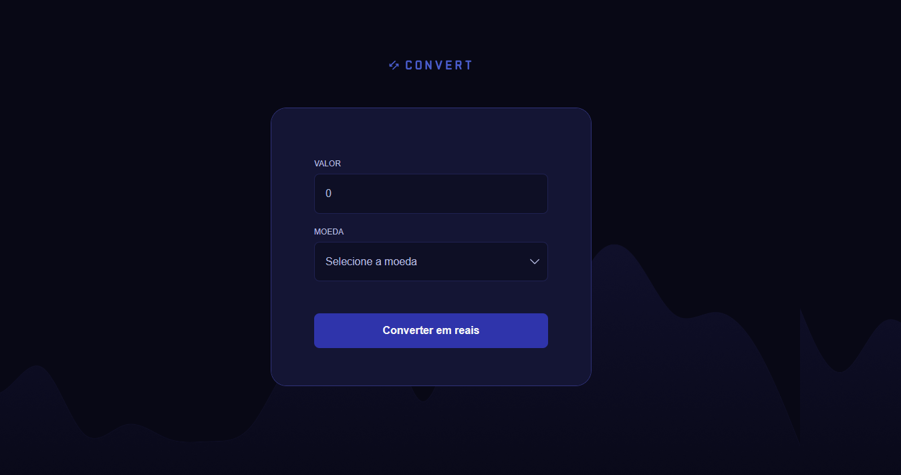

<h1> 🚀 Projeto prático - Conversor de Moedas</h1>

  

## 🚀 Tecnologias

Esse projeto foi desenvolvido com as seguintes tecnologias:

- HTML
- CSS
- javaScript
- Git e Github
- Figma

## 💻 Projeto

Página web deum conversor de moedas.
Este projeto foi realizado no curso de Fullstack da Rocketseat como projeto prático no módulo de JavaScript básico.

## ✨ Melhorias Realizadas

Fui responsável por implementar a **responsividade** da página, garantindo que o conversor de moedas funcionasse bem em dispositivos móveis.
